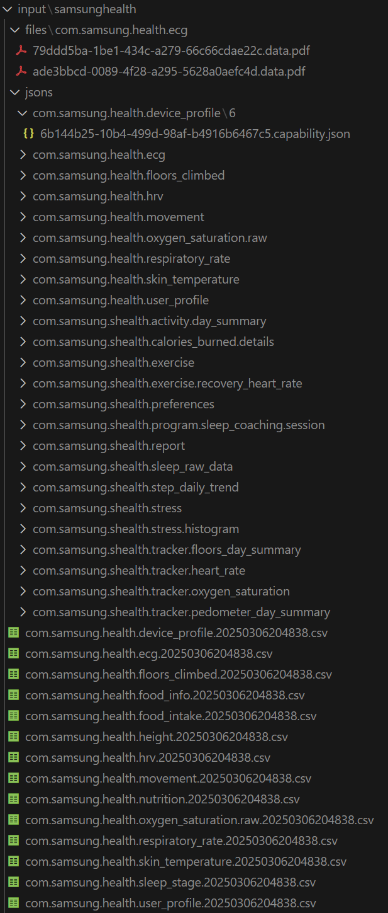

# Samsung-health-parse-
A simple script showing how to read data downloaded from Samsung Health app
Code below is inspired with article of K Scott Mader:
>https://www.kaggle.com/code/kmader/analyzing-samsung-health-data/notebook#Step-Counts

## Getting data from Samsung health app
Process of downloading your personal data recorded by wearable devices is described below:
>https://www.samsung.com/ae/support/apps-services/how-can-i-retrieve-my-personal-data-from-samsung-health/

## Structure of files in downloaded data
- Samsung Health
    - files
        - com.samsung.health.*
    - jsons
        - com.samsung.health.*
    - com.samsung.health.*.csv

## Reading data
In this script I will focus only at *csv* files, that provide comprehensive information about main health indicators.

Sleep data reading script -> [sleep.ipynb](./sleep.ipynb)
